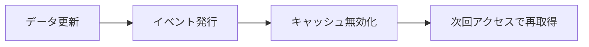
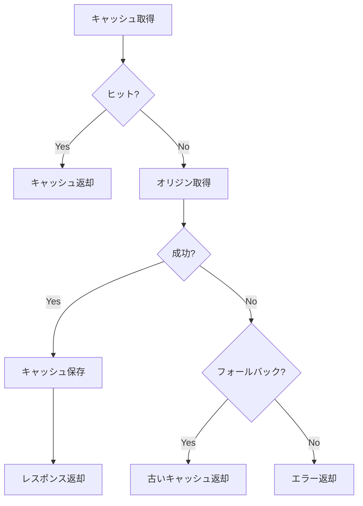

# キャッシュ戦略設計書

## 設計方針

| 項目 | 内容 |
|------|------|
| 基本方針 | {{CACHE_POLICY}} |
| 目標ヒット率 | {{TARGET_HIT_RATE}} |
| 関連NFR | {{NFR_IDS}} |
| 関連ADR | {{ADR_IDS}} |

## レイヤー別キャッシュ設計

### ブラウザキャッシュ

| 項目 | 設定 |
|------|------|
| 対象 | {{BROWSER_CACHE_TARGET}} |
| Cache-Control | {{CACHE_CONTROL}} |
| ETag | {{ETAG_STRATEGY}} |

#### 静的アセット

| アセット種別 | max-age | 更新戦略 |
|-------------|---------|----------|
| {{ASSET_TYPE}} | {{MAX_AGE}} | {{UPDATE_STRATEGY}} |

### CDNキャッシュ

| 項目 | 設定 |
|------|------|
| プロバイダー | {{CDN_PROVIDER}} |
| キャッシュ対象 | {{CDN_CACHE_TARGET}} |
| TTL | {{CDN_TTL}} |

#### キャッシュルール

| パス | キャッシュ | TTL | 備考 |
|------|----------|-----|------|
| {{PATH}} | {{CACHED}} | {{TTL}} | {{NOTES}} |

### アプリケーションキャッシュ

| 項目 | 設定 |
|------|------|
| 技術 | {{APP_CACHE_TECH}} |
| 用途 | {{APP_CACHE_PURPOSE}} |
| メモリ上限 | {{MEMORY_LIMIT}} |

#### キャッシュ対象

| データ種別 | TTL | 優先度 | 理由 |
|-----------|-----|--------|------|
| {{DATA_TYPE}} | {{TTL}} | {{PRIORITY}} | {{REASON}} |

### データベースキャッシュ

| 項目 | 設定 |
|------|------|
| クエリキャッシュ | {{QUERY_CACHE}} |
| リードレプリカ | {{READ_REPLICA}} |

## キャッシュキー設計

### 命名規則

| パターン | 例 | 用途 |
|---------|-----|------|
| {{KEY_PATTERN}} | {{KEY_EXAMPLE}} | {{KEY_PURPOSE}} |

### キー構成要素

```
{prefix}:{entity}:{id}:{version}

例: app:user:12345:v1
```

| 要素 | 説明 |
|------|------|
| prefix | 環境識別子（prod/stg/dev） |
| entity | エンティティ名 |
| id | 一意識別子 |
| version | スキーマバージョン |

## キャッシュ無効化戦略

### TTL（時間ベース）

| データ種別 | TTL | 理由 |
|-----------|-----|------|
| {{DATA_TYPE}} | {{TTL}} | {{REASON}} |

### イベント駆動

| イベント | 無効化対象 | 処理 |
|---------|-----------|------|
| {{EVENT}} | {{INVALIDATION_TARGET}} | {{PROCESS}} |



### バージョニング

| 対象 | 戦略 | 例 |
|------|------|-----|
| 静的アセット | ファイル名ハッシュ | main.abc123.js |
| API | URLバージョニング | /api/v2/users |
| データスキーマ | キーバージョン | user:123:v2 |

## キャッシュウォームアップ

| タイミング | 対象 | 方法 |
|-----------|------|------|
| {{TIMING}} | {{WARMUP_TARGET}} | {{WARMUP_METHOD}} |

## 監視・運用

### メトリクス

| メトリクス | 閾値 | アラート条件 |
|-----------|------|-------------|
| ヒット率 | {{HIT_RATE_THRESHOLD}} | {{HIT_RATE_ALERT}} |
| レイテンシ | {{LATENCY_THRESHOLD}} | {{LATENCY_ALERT}} |
| メモリ使用率 | {{MEMORY_THRESHOLD}} | {{MEMORY_ALERT}} |
| エビクション数 | {{EVICTION_THRESHOLD}} | {{EVICTION_ALERT}} |

### ダッシュボード

| 項目 | 可視化 |
|------|--------|
| キャッシュヒット率推移 | 時系列グラフ |
| レイテンシ分布 | ヒストグラム |
| メモリ使用量 | ゲージ |
| キー数推移 | 時系列グラフ |

## 障害時の挙動

### キャッシュサーバー障害

| 状況 | 挙動 | 復旧手順 |
|------|------|----------|
| Redis障害 | {{REDIS_FALLBACK}} | {{REDIS_RECOVERY}} |
| CDN障害 | {{CDN_FALLBACK}} | {{CDN_RECOVERY}} |

### フォールバック戦略



### サーキットブレーカー

| 項目 | 設定 |
|------|------|
| 失敗閾値 | {{FAILURE_THRESHOLD}} |
| リセット時間 | {{RESET_TIMEOUT}} |
| ハーフオープン試行 | {{HALF_OPEN_REQUESTS}} |

## セキュリティ考慮

| 項目 | 対策 |
|------|------|
| 機密データ | キャッシュ対象外 or 暗号化 |
| 認証トークン | 短TTL + セキュアストレージ |
| 個人情報 | ユーザー別キー + アクセス制御 |

## コスト最適化

| 施策 | 効果 |
|------|------|
| {{OPTIMIZATION}} | {{EFFECT}} |

## 変更履歴

| 日付 | Ver | 変更者 | 内容 |
|------|-----|--------|------|
| {{DATE}} | {{VERSION}} | {{AUTHOR}} | {{CHANGE}} |
