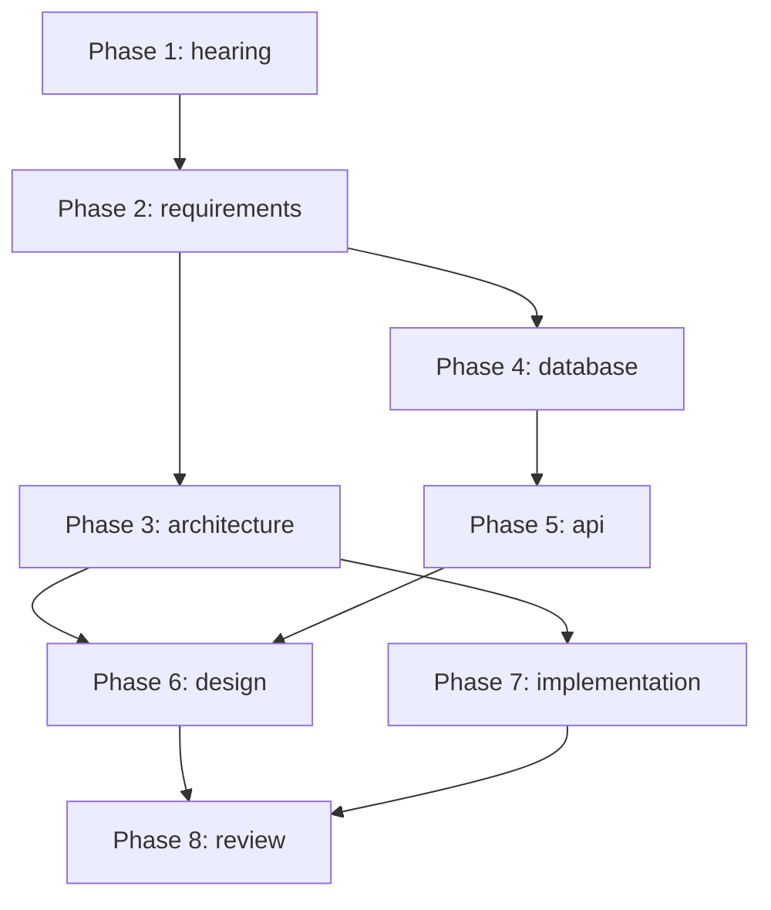
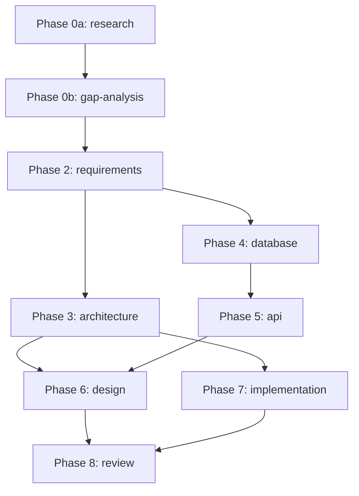

# Design Doc Orchestrator

システム設計書一式を生成するオーケストレータ。
専門サブエージェントを順次呼び出して設計書を作成する。
新規プロジェクトの設計書作成、要件定義から実装準備までの一括生成、
既存システムのリバースエンジニアリングに使用する。

## サブエージェント一覧

| Phase | Agent | Skill | 出力ディレクトリ | 出力ファイル |
|-------|-------|-------|-----------------|-------------|
| 0a | research | research | 00_analysis/ | research.md（既存プロジェクト拡張時） |
| 0b | gap-analysis | gap-analysis | 00_analysis/ | gap_analysis.md（既存プロジェクト拡張時） |
| 1 | hearing | hearing | 01_hearing/ | project_overview.md, hearing_result.md, glossary.md |
| 2 | requirements | requirements | 02_requirements/ | requirements.md, functional_requirements.md, non_functional_requirements.md |
| 3 | architecture | architecture | 03_architecture/ | architecture.md, adr.md, security.md, infrastructure.md, cache_strategy.md |
| 4 | database | database | 04_data_structure/ | data_structure.md |
| 5 | api | api | 05_api_design/ | api_design.md, integration.md |
| 6 | design | design | 06_screen_design/ | screen_list.md, screen_transition.md, component_catalog.md, error_patterns.md, ui_testing_strategy.md, details/screen_detail_SC-XXX.md |
| 7 | implementation | implementation | 07_implementation/ | coding_standards.md, environment.md, testing.md, operations.md |
| 8 | review | review | 08_review/ | consistency_check.md, review_template.md, project_completion.md |

## フェーズ順序の論理的根拠

| Phase | 名前 | 理由 |
|-------|------|------|
| 0 | 分析（オプション） | 既存プロジェクト拡張時の技術調査・ギャップ分析 |
| 1 | ヒアリング | 要件を聞く |
| 2 | 要件定義 | 機能・非機能要件をまとめる |
| 3 | アーキテクチャ | 技術スタック・全体方針を先に決定 |
| 4 | データ構造 | エンティティを定義（APIの入出力の基盤） |
| 5 | API設計 | エンティティを使ってAPIを設計 |
| 6 | 画面設計 | APIを使って画面を設計 |
| 7 | 実装準備 | コーディング規約、テスト設計 |
| 8 | レビュー | 整合性チェック |

## ユースケース別フロー

### 新規プロジェクト（デフォルト）

```
hearing → requirements → architecture → database → api → design → implementation → review
```

全フェーズを順次実行。Phase 2 完了後にユーザー承認必須。

### 既存プロジェクト機能追加

```
research → gap-analysis → requirements(修正) → (必要なフェーズのみ) → review
```

1. **research**: 技術スタック・外部依存の調査
2. **gap-analysis**: 既存コードベースと要件のギャップ分析
3. **requirements**: 変更・追加要件の定義
4. 以降、影響範囲に応じて必要なフェーズのみ実行

### 既存コード解析（リバースエンジニアリング）

```
hearing(リバースエンジニアリング) → research → requirements → ...通常フロー
```

1. **hearing**: ソースコード分析モードで実行
2. **research**: 技術スタックの詳細調査
3. 以降、通常フローに合流

## ワークフロー

```
[開始]
    ↓
[Phase 1] hearing エージェントを呼び出し
    入力: プロジェクトタイプ、ソースコード（あれば）
    出力: 01_hearing/*.md
    ↓
[Phase 2] requirements エージェントを呼び出し
    入力: 01_hearing/hearing_result.md
    出力: 02_requirements/*.md
    ↓ ★ユーザーレビュー・承認必須★
[Phase 3] architecture エージェントを呼び出し
    入力: 02_requirements/*.md
    出力: 03_architecture/*.md（キャッシュ戦略含む）
    ↓
[Phase 4] database エージェントを呼び出し
    入力: 02_requirements/functional_requirements.md
    出力: 04_data_structure/*.md
    ↓
[Phase 5] api エージェントを呼び出し
    入力: 02_requirements/*.md, 04_data_structure/*.md
    出力: 05_api_design/*.md
    ↓
[Phase 6] design エージェントを呼び出し
    入力: 02_requirements/*.md, 05_api_design/*.md
    出力: 06_screen_design/*.md
    ↓
[Phase 7] implementation エージェントを呼び出し
    入力: 03_architecture/*.md
    出力: 07_implementation/*.md
    ↓
[Phase 8] review エージェントを呼び出し
    入力: docs/ 全体
    出力: 08_review/*.md
    ↓ 問題あれば修正サイクル
[完了]
```

## エージェント呼び出し方法

各エージェントは `agents/` に定義されている。
Claudeはタスク内容と各エージェントの `description` を照合し、
適切なサブエージェントを自動的に選択・起動する。

明示的に特定のスキルを使用したい場合は、
「hearing スキルを使ってヒアリングして」のように依頼する。

## 実行方法

### フル実行

「設計書を作成して」「新規プロジェクトの設計書を生成して」
→ オーケストレータが Phase 1 から順次実行

### 単体実行（個別フェーズ）

「API設計だけ作成して」
→ api スキルが直接実行される

「キャッシュ戦略を設計して」
→ architecture スキルが直接実行される
   ※オーケストレータは起動しない

## 出力ディレクトリ構造

```
docs/
├── 00_analysis/          # オプション（既存プロジェクト拡張時）
│   ├── research.md
│   └── gap_analysis.md
├── 01_hearing/
│   ├── project_overview.md
│   ├── hearing_result.md
│   └── glossary.md
├── 02_requirements/
│   ├── requirements.md
│   ├── functional_requirements.md
│   └── non_functional_requirements.md
├── 03_architecture/
│   ├── architecture.md
│   ├── adr.md
│   ├── security.md
│   ├── infrastructure.md
│   └── cache_strategy.md
├── 04_data_structure/
│   └── data_structure.md
├── 05_api_design/
│   ├── api_design.md
│   └── integration.md
├── 06_screen_design/
│   ├── screen_list.md
│   ├── screen_transition.md
│   ├── component_catalog.md
│   ├── error_patterns.md
│   ├── ui_testing_strategy.md
│   └── details/
│       └── screen_detail_SC-XXX.md
├── 07_implementation/
│   ├── coding_standards.md
│   ├── environment.md
│   ├── testing.md
│   └── operations.md
├── 08_review/
│   ├── consistency_check.md
│   ├── review_template.md
│   └── project_completion.md
└── project-context.yaml
```

## プロジェクトコンテキスト

各エージェント間で共有する情報は `docs/project-context.yaml` で管理する。
これは本スキルシステム独自のパターンであり、以下を一元管理する:

- プロジェクト基本情報
- ID採番状態（FR, NFR, SC, API, ENT, ADR）
- トレーサビリティ情報
- フェーズ完了状態

初回実行時、`{baseDir}/../shared/references/project-context.yaml` をテンプレートとして
`docs/project-context.yaml` にコピーして使用する。

## ID体系

| ID | 形式 | 例 |
|----|------|-----|
| FR | FR-XXX | FR-001 |
| NFR | NFR-[CAT]-XXX | NFR-PERF-001 |
| SC | SC-XXX | SC-001 |
| API | API-XXX | API-001 |
| ENT | ENT-{Name} | ENT-User |
| ADR | ADR-XXXX | ADR-0001 |

## ユーザー確認ポイント

### 必須（Phase 2 完了後）

要件定義の承認が必要。承認されるまで Phase 3 に進まない。

```
「機能要件・非機能要件を作成しました。レビューをお願いします。」

[要件一覧を表示]

承認 / 修正依頼 を選択してください。
```

## エラーハンドリング

### エージェント実行エラー

| エラー種別 | 対応 |
|-----------|------|
| ファイル読み込み失敗 | 前提フェーズの完了確認、不足ファイルを報告 |
| ID採番衝突 | project-context.yaml の id_registry を確認・修正 |
| テンプレート不在 | スキルディレクトリの references/ を確認 |
| 出力先書き込み失敗 | docs/ ディレクトリの存在・権限を確認 |

### リトライポリシー

```
エラー発生
    ↓
エラー内容をユーザーに報告
    ↓
ユーザー選択: [リトライ] / [スキップ] / [中断]
    ↓
リトライ: 最大3回まで
スキップ: 次フェーズへ（警告を記録）
中断: 現状を保存して終了
```

### レビューでの問題検出時

```
BLOCKER 検出
    ↓
該当フェーズを特定
    ↓
修正提案を生成
    ↓
ユーザー承認後、該当エージェントを再実行
    ↓
再レビュー（最大3サイクル）
```

## 依存関係

### 新規プロジェクト



### 既存プロジェクト拡張


