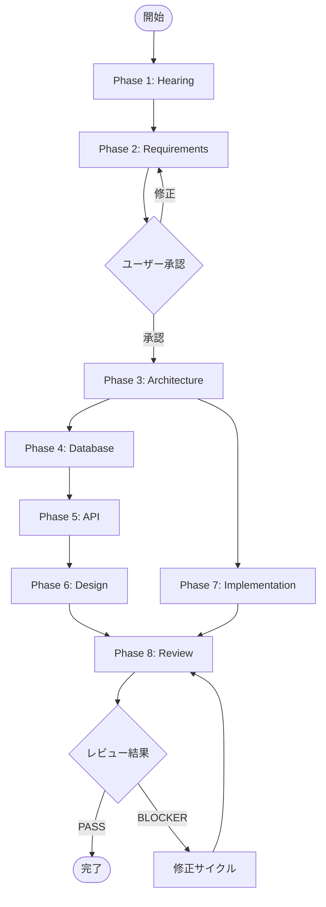

# Workflow Guide

設計書作成ワークフローの詳細ガイド。

## ワークフロー概要図



## フェーズ詳細

### Phase 1: Hearing（ヒアリング）

**目的**: プロジェクトの要件を収集・整理する

**入力**:
- ユーザーとの対話
- 既存ソースコード（リバースエンジニアリング時）

**出力**:
- `docs/01_hearing/project_overview.md`
- `docs/01_hearing/hearing_result.md`
- `docs/01_hearing/glossary.md`

**完了条件**:
- プロジェクト概要が明確
- 主要機能が特定されている
- 用語集が作成されている

---

### Phase 2: Requirements（要件定義）

**目的**: 機能要件・非機能要件を定義する

**入力**:
- `docs/01_hearing/hearing_result.md`
- `docs/01_hearing/glossary.md`

**出力**:
- `docs/02_requirements/requirements.md`
- `docs/02_requirements/functional_requirements.md`
- `docs/02_requirements/non_functional_requirements.md`

**完了条件**:
- 全FRにIDが採番されている
- 全FRに優先度が設定されている
- 受入基準が検証可能

**重要**: このフェーズ完了後、ユーザーレビュー・承認が必須

---

### Phase 3: Architecture（アーキテクチャ）

**目的**: システム全体の構成を設計する

**入力**:
- `docs/02_requirements/non_functional_requirements.md`
- `docs/02_requirements/functional_requirements.md`

**出力**:
- `docs/03_architecture/architecture.md`
- `docs/03_architecture/adr.md`
- `docs/03_architecture/security.md`
- `docs/03_architecture/infrastructure.md`
- `docs/03_architecture/cache_strategy.md`

**完了条件**:
- 技術スタックが決定されている
- 全選定理由がADRとして記録されている
- セキュリティ設計がある

---

### Phase 4: Database（データ構造）

**目的**: エンティティとデータ構造を定義する

**入力**:
- `docs/02_requirements/functional_requirements.md`

**出力**:
- `docs/04_data_structure/data_structure.md`

**完了条件**:
- 全エンティティにIDが採番されている
- TypeScript型定義が正しい
- FR→ENT のトレーサビリティがある

**重要**: API設計より先に実行する

---

### Phase 5: API（API設計）

**目的**: RESTful APIを設計する

**入力**:
- `docs/02_requirements/functional_requirements.md`
- `docs/04_data_structure/data_structure.md`

**出力**:
- `docs/05_api_design/api_design.md`
- `docs/05_api_design/integration.md`

**完了条件**:
- 全APIにIDが採番されている
- RESTful設計原則に従っている
- FR→API, API→ENT のトレーサビリティがある

---

### Phase 6: Design（画面設計）

**目的**: ユーザーインターフェースを設計する

**入力**:
- `docs/02_requirements/functional_requirements.md`
- `docs/05_api_design/api_design.md`

**出力**:
- `docs/06_screen_design/screen_list.md`
- `docs/06_screen_design/screen_transition.md`
- `docs/06_screen_design/component_catalog.md`
- `docs/06_screen_design/details/screen_detail_SC-XXX.md`

**完了条件**:
- 全画面にIDが採番されている
- 画面遷移図がMermaidで記述されている
- FR→SC, API→SC のトレーサビリティがある

---

### Phase 7: Implementation（実装準備）

**目的**: 実装に必要なドキュメントを作成する

**入力**:
- `docs/03_architecture/architecture.md`
- `docs/03_architecture/adr.md`

**出力**:
- `docs/07_implementation/coding_standards.md`
- `docs/07_implementation/environment.md`
- `docs/07_implementation/testing.md`
- `docs/07_implementation/operations.md`

**完了条件**:
- コーディング規約が技術スタックに適合
- 環境設定が網羅されている
- テスト戦略が定義されている

---

### Phase 8: Review（レビュー）

**目的**: 設計書全体の整合性をチェックする

**入力**:
- `docs/` 配下の全設計書
- `docs/project-context.yaml`

**出力**:
- `docs/08_review/consistency_check.md`
- `docs/08_review/review_template.md`
- `docs/08_review/project_completion.md`

**完了条件**:
- 3レベル全てのチェックが完了
- BLOCKERが0件
- 完了サマリーが生成されている

## ユーザー確認ポイント

### 必須確認: Phase 2 完了後

要件定義の承認が必要。承認されるまで Phase 3 に進まない。

```
表示例:
---
機能要件・非機能要件を作成しました。

[要件一覧サマリー]

レビューをお願いします。
- [承認] 次のフェーズに進む
- [修正] 修正点を指示する
---
```

### 任意確認: 各フェーズ完了後

ユーザーが確認を希望した場合、各フェーズ完了後に確認を挟む。

## エラーリカバリ

### 前提ファイル不在

```
状況: Phase 5 実行時に data_structure.md がない

対応:
1. 「Phase 4（データ構造）が未完了です」と報告
2. Phase 4 の実行を提案
3. ユーザー承認後、Phase 4 を実行
4. Phase 5 を再開
```

### レビューでBLOCKER検出

```
状況: 重複IDが検出された

対応:
1. 該当フェーズと問題を報告
2. 修正案を提示
3. ユーザー承認後、該当フェーズを再実行
4. 再レビュー（最大3サイクル）
```

## 部分実行の例

### API設計以降を実行

```
前提条件:
- docs/02_requirements/ が存在
- docs/04_data_structure/ が存在

実行フロー:
api → design → review
```

### 画面設計のみ再実行

```
前提条件:
- docs/02_requirements/ が存在
- docs/05_api_design/ が存在

実行フロー:
design のみ
```

## プロジェクトコンテキストの活用

`docs/project-context.yaml` で以下を管理:

```yaml
project:
  name: プロジェクト名
  type: webapp
  created_at: 2024-01-01

phases:
  hearing:
    status: completed
  requirements:
    status: completed
  # ...

id_registry:
  fr: [FR-001, FR-002, FR-003]
  nfr: [NFR-PERF-001]
  ent: [ENT-User, ENT-Product]
  api: [API-001, API-002]
  sc: [SC-001, SC-002]
  adr: [ADR-0001]

traceability:
  fr_to_ent:
    FR-001: [ENT-Product]
  fr_to_api:
    FR-001: [API-001]
  # ...
```
