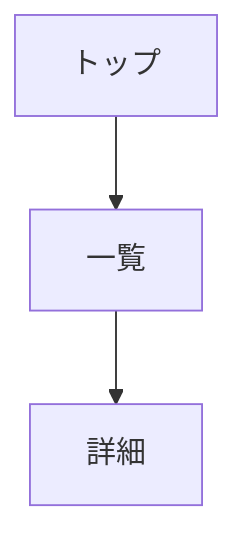

# Design Skill

画面設計を行うスキル。
UIレイアウト設計、ワイヤーフレーム作成、画面フロー定義、
ユーザーインターフェース仕様の文書化に使用する。

## 前提条件

| 条件 | 必須 | 説明 |
|------|------|------|
| docs/02_requirements/functional_requirements.md | ○ | 画面抽出元 |
| docs/05_api_design/api_design.md | ○ | 画面操作で使用するAPI |

## 出力ファイル

| ファイル | テンプレート | 説明 |
|---------|-------------|------|
| docs/06_screen_design/screen_list.md | {baseDir}/references/screen_list.md | 画面一覧 |
| docs/06_screen_design/screen_transition.md | {baseDir}/references/screen_transition.md | 画面遷移図 |
| docs/06_screen_design/component_catalog.md | {baseDir}/references/component_catalog.md | コンポーネント |
| docs/06_screen_design/details/screen_detail_SC-XXX.md | {baseDir}/references/details/screen_detail_template.md | 画面詳細 |

## 依存関係

| 種別 | 対象 |
|------|------|
| 前提スキル | requirements, api |
| 後続スキル | review |

## ID採番ルール

| 項目 | ルール |
|------|--------|
| 形式 | SC-XXX（3桁ゼロパディング） |
| 開始 | 001 |

## ワークフロー

```
1. 機能要件（FR）・API設計を読み込み
2. FRから必要な画面を抽出
3. 画面をカテゴリ分類
4. 各画面にSC-IDを採番
5. 画面一覧を生成
6. 画面遷移図を生成（Mermaid）
7. APIを使用して画面要素を設計
8. 共通コンポーネントを抽出
9. 各画面の詳細設計を生成
```

**重要**: このフェーズはAPI設計後に実行する。
画面はAPIを使用して設計し、SC→API のトレーサビリティを記録する。

## 画面カテゴリ

| カテゴリ | 説明 |
|---------|------|
| Public | 認証不要 |
| Auth | 認証関連 |
| Member | 要認証 |
| Admin | 管理者用 |
| System | システム |

## ワイヤーフレーム

PC版・SP版のアスキーアートを作成:

```
+------------------+
| [Logo]  [Menu]   |
+------------------+
| Content          |
+------------------+
```

## 画面遷移図（Mermaid）



## コンテキスト更新

```yaml
phases:
  design:
    status: completed
    files:
      - docs/06_screen_design/screen_list.md
      - docs/06_screen_design/screen_transition.md
      - docs/06_screen_design/component_catalog.md
      - docs/06_screen_design/details/screen_detail_SC-XXX.md
id_registry:
  sc: [SC-001, SC-002, ...]
traceability:
  fr_to_sc:
    FR-001: [SC-001, SC-002]
  api_to_sc:
    API-001: [SC-001, SC-002]  # APIを使用する画面
```

## エラーハンドリング

| エラー | 対応 |
|--------|------|
| FR 不在 | Phase 2 の実行を促す |
| API 不在 | Phase 5 の実行を促す |
| 未定義API参照 | WARNING を記録、API追加を提案 |
