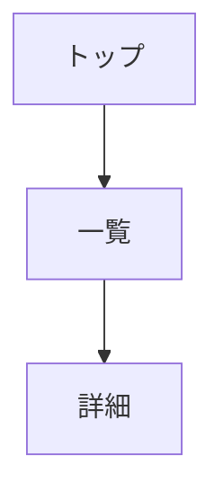

# Design Skill

画面設計を行うスキル。
UIレイアウト設計、ワイヤーフレーム作成、画面フロー定義、
ユーザーインターフェース仕様の文書化に使用する。

## 前提条件

| 条件 | 必須 | 説明 |
|------|------|------|
| docs/02_requirements/functional_requirements.md | ○ | 画面抽出元 |
| docs/03_architecture/architecture.md | ○ | エラーハンドリング設計参照 |
| docs/05_api_design/api_design.md | ○ | 画面操作で使用するAPI |

## 出力ファイル

| ファイル | テンプレート | 説明 |
|---------|-------------|------|
| docs/06_screen_design/screen_list.md | {baseDir}/references/screen_list.md | 画面一覧 |
| docs/06_screen_design/screen_transition.md | {baseDir}/references/screen_transition.md | 画面遷移図 |
| docs/06_screen_design/component_catalog.md | {baseDir}/references/component_catalog.md | コンポーネント |
| docs/06_screen_design/error_patterns.md | {baseDir}/references/error_patterns.md | エラー表示パターン |
| docs/06_screen_design/ui_testing_strategy.md | {baseDir}/references/ui_testing_strategy.md | 画面テスト戦略 |
| docs/06_screen_design/details/screen_detail_SC-XXX.md | {baseDir}/references/details/screen_detail_template.md | 画面詳細 |

## 依存関係

| 種別 | 対象 |
|------|------|
| 前提スキル | requirements, architecture, api |
| 後続スキル | review |

## ID採番ルール

| 項目 | ルール |
|------|--------|
| 形式 | SC-XXX（3桁ゼロパディング） |
| 開始 | 001 |

## ワークフロー

```
1. 機能要件（FR）・API設計を読み込み
2. 設計スコープ（Goals/Non-Goals）を定義
3. FRから必要な画面を抽出
4. 画面をカテゴリ分類
5. 各画面にSC-IDを採番
6. 画面一覧を生成
7. 画面遷移図を生成（Mermaid）
8. APIを使用して画面要素を設計
9. 共通コンポーネントを抽出
10. コンポーネント依存関係と優先度（P0/P1/P2）を定義
11. エラー表示パターンを定義
12. 各画面の詳細設計を生成 ← **全SC-IDに対して必須**
13. 画面テスト戦略を策定
14. 画面詳細ファイルの完全性を検証
```

**重要**: このフェーズはAPI設計後に実行する。
画面はAPIを使用して設計し、SC→API のトレーサビリティを記録する。

## 画面詳細ファイル生成ルール

**必須**: screen_list.md に定義した全てのSC-IDに対して、
対応する `screen_detail_SC-XXX.md` ファイルを必ず作成すること。

| チェック項目 | 説明 |
|-------------|------|
| 全SC-IDに対応するファイル存在 | screen_list.mdの各SC-IDに対して details/screen_detail_SC-XXX.md が存在 |
| モーダル画面も含む | URLがなくても画面IDがあれば詳細設計書を作成 |
| ファイル命名規則 | `screen_detail_SC-XXX.md` (XXXは3桁ゼロパディング) |

**完了条件**:
```
定義済SC-ID数 == details/screen_detail_SC-*.md ファイル数
```

## 画面カテゴリ

| カテゴリ | 説明 |
|---------|------|
| Public | 認証不要 |
| Auth | 認証関連 |
| Member | 要認証 |
| Admin | 管理者用 |
| System | システム |

## ワイヤーフレーム

PC版・SP版のアスキーアートを作成:

```
+------------------+
| [Logo]  [Menu]   |
+------------------+
| Content          |
+------------------+
```

## 画面遷移図（Mermaid）



## コンテキスト更新

```yaml
phases:
  design:
    status: completed
    files:
      - docs/06_screen_design/screen_list.md
      - docs/06_screen_design/screen_transition.md
      - docs/06_screen_design/component_catalog.md
      - docs/06_screen_design/details/screen_detail_SC-XXX.md
id_registry:
  sc: [SC-001, SC-002, ...]
traceability:
  fr_to_sc:
    FR-001: [SC-001, SC-002]
  api_to_sc:
    API-001: [SC-001, SC-002]  # APIを使用する画面
```

## 設計スコープ（Goals / Non-Goals）

画面設計の目的と対象外を明確化する。

| 項目 | 説明 |
|------|------|
| Goals | この画面設計が達成すべき目標（ユーザー体験、主要フロー対応等） |
| Non-Goals | 今回スコープ外（管理画面、高度なカスタマイズ等） |

**記載場所**: screen_list.md の冒頭

## コンポーネント依存関係（優先度分類）

| 優先度 | 説明 | 例 |
|--------|------|-----|
| P0（Critical） | 必須依存、これがないと機能しない | AuthProvider, ThemeContext |
| P1（Important） | 重要だが代替可能 | AnalyticsProvider, ErrorBoundary |
| P2（Optional） | あれば便利、なくても動作する | ToastContext, HelpTooltip |

**記載場所**: component_catalog.md および screen_detail_template.md

## エラー表示パターン

| カテゴリ | HTTPステータス | 画面表示パターン | 例 |
|---------|---------------|-----------------|-----|
| User Errors | 4xx | フィールドエラー、インラインバリデーション | 入力不備、認証エラー |
| System Errors | 5xx | エラー画面、リトライ誘導 | サーバーエラー、タイムアウト |
| Business Logic | 422 | 状態説明、ガイダンス表示 | ルール違反、状態不整合 |

**記載場所**: error_patterns.md

## 画面テスト戦略

| テストレベル | 対象 | カバレッジ目標 |
|-------------|------|---------------|
| Component Tests | 個別UIコンポーネント | 主要状態・Props |
| Integration Tests | 画面単位のユーザーフロー | クリティカルパス |
| E2E Tests | ユーザーシナリオ全体 | 主要業務フロー |
| Visual Regression | UIスナップショット | 主要画面 |

**記載場所**: ui_testing_strategy.md

## エラーハンドリング

| エラー | 対応 |
|--------|------|
| FR 不在 | Phase 2 の実行を促す |
| API 不在 | Phase 5 の実行を促す |
| 未定義API参照 | WARNING を記録、API追加を提案 |
