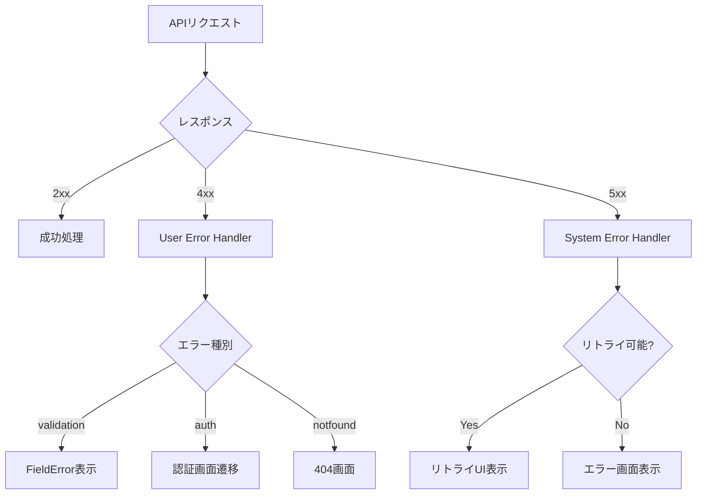

# エラー表示パターン

## 1. エラーカテゴリ定義

### User Errors (4xx系)

| エラー種別 | 表示パターン | コンポーネント | UX考慮事項 |
|-----------|-------------|---------------|-----------|
| バリデーションエラー | フィールド下インライン表示 | FieldError | 入力中リアルタイム or blur時 |
| 認証エラー | フォーム上部バナー | AlertBanner | 再認証への導線 |
| 認可エラー | 専用画面 or モーダル | AccessDenied | 権限申請への導線 |
| 404 Not Found | 専用画面 | NotFoundPage | 代替候補の提示 |
| {{ERROR_TYPE}} | {{PATTERN}} | {{COMPONENT}} | {{UX_NOTES}} |

### System Errors (5xx系)

| エラー種別 | 表示パターン | コンポーネント | UX考慮事項 |
|-----------|-------------|---------------|-----------|
| サーバーエラー | エラー画面 + リトライ | ErrorPage | 自動リトライ or 手動ボタン |
| タイムアウト | 警告バナー + リトライ | TimeoutBanner | プログレス表示 |
| ネットワークエラー | オフラインインジケータ | OfflineIndicator | オフライン時の代替動作 |
| {{ERROR_TYPE}} | {{PATTERN}} | {{COMPONENT}} | {{UX_NOTES}} |

### Business Logic Errors (422系)

| エラー種別 | 表示パターン | コンポーネント | UX考慮事項 |
|-----------|-------------|---------------|-----------|
| ルール違反 | 説明付きモーダル | RuleViolationModal | 次のアクション提示 |
| 状態不整合 | ステータス表示 + ガイダンス | StateConflictAlert | 解決手順の提示 |
| リソース枯渇 | 警告バナー | ResourceLimitBanner | アップグレード導線 |
| {{ERROR_TYPE}} | {{PATTERN}} | {{COMPONENT}} | {{UX_NOTES}} |

## 2. エラー表示コンポーネント仕様

### FieldError

| Props | 型 | 説明 |
|-------|-----|------|
| message | string | エラーメッセージ |
| fieldId | string | 関連フィールドID |
| {{PROP}} | {{TYPE}} | {{DESC}} |

### AlertBanner

| Props | 型 | 説明 |
|-------|-----|------|
| type | 'error' \| 'warning' \| 'info' | バナー種別 |
| message | string | 表示メッセージ |
| dismissible | boolean | 閉じるボタン表示 |
| {{PROP}} | {{TYPE}} | {{DESC}} |

### ErrorPage

| Props | 型 | 説明 |
|-------|-----|------|
| errorCode | number | HTTPステータスコード |
| title | string | エラータイトル |
| description | string | エラー説明 |
| retryAction | () => void | リトライ関数 |
| {{PROP}} | {{TYPE}} | {{DESC}} |

## 3. エラーフロー図

## 4. 画面別エラーマッピング

| SC-ID | 画面名 | 想定エラー | 表示パターン | 備考 |
|-------|--------|-----------|-------------|------|
| {{SC_ID}} | {{NAME}} | {{ERROR_TYPES}} | {{PATTERN}} | {{NOTES}} |

## 5. エラーメッセージ規約

### メッセージ構成

| 要素 | 説明 | 例 |
|------|------|-----|
| What | 何が起きたか | 「入力内容に誤りがあります」 |
| Why | なぜ起きたか（必要な場合） | 「パスワードが短すぎます」 |
| How | どうすればよいか | 「8文字以上で入力してください」 |

### トーン&マナー

| 原則 | 説明 |
|------|------|
| 責めない | 「入力エラー」ではなく「確認してください」 |
| 具体的に | 「エラーです」ではなく具体的な内容を |
| 次のアクションを示す | 解決方法を明示 |

## 変更履歴

| 日付 | Ver | 変更者 | 内容 |
|------|-----|--------|------|
| {{DATE}} | {{VERSION}} | {{AUTHOR}} | {{CHANGE}} |
